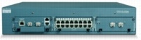
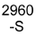
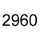
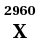
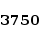

# f_logos

These are logos created for Nagios, Icinga and Op5 Monitor.

The logos can be used in various places in the graphical user interface.


## Usage
In order to make them visible copy the files to 
```sh
/opt/monitor/op5/ninja/application/media/images/logos
```

## Examples
                        
                    
                              
                          
                            
                  
                             
                   
                        
                       
                      
                
                  


## Disclaimer
These pictures and logos are not authorized by, sponsored by or associated with the trademark owners.

___

Licensed under the [__Apache License Version 2.0__](https://www.apache.org/licenses/LICENSE-2.0)

Written by __farid@joubbi.se__

http://www.joubbi.se/monitoring.html

